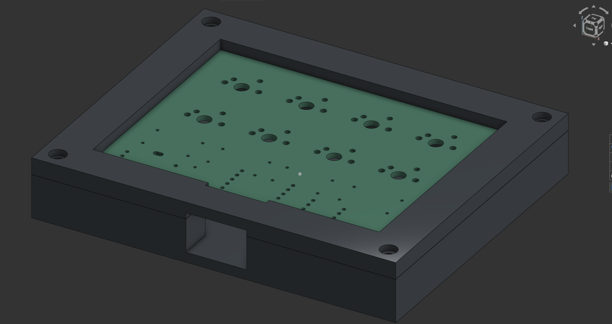
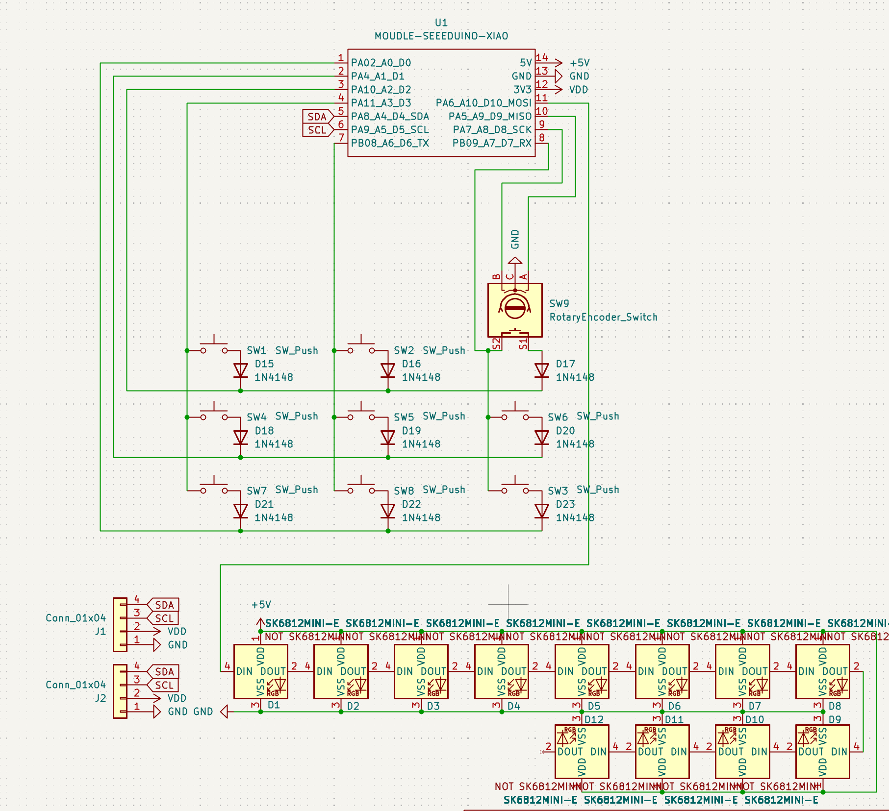
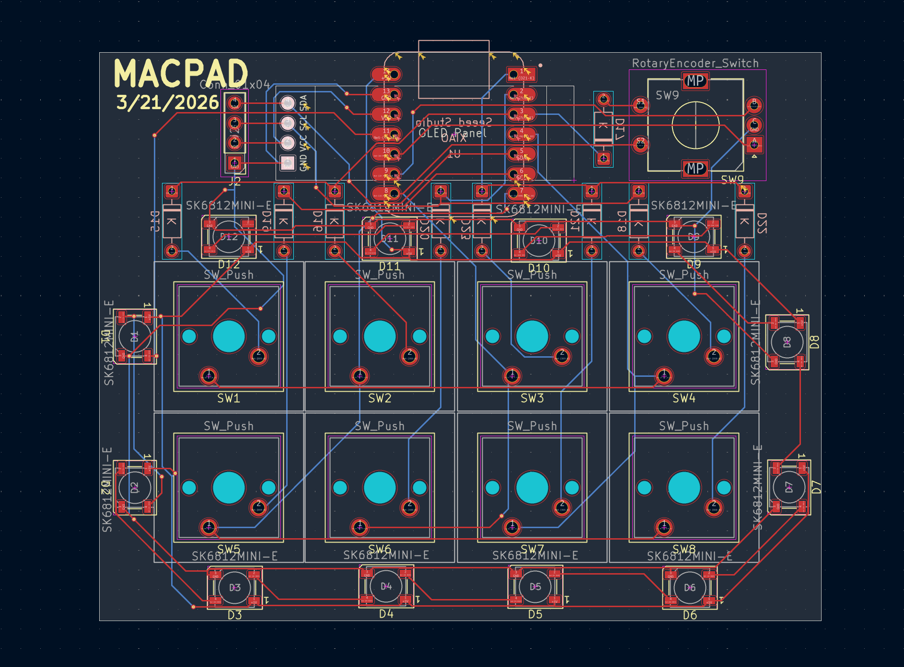
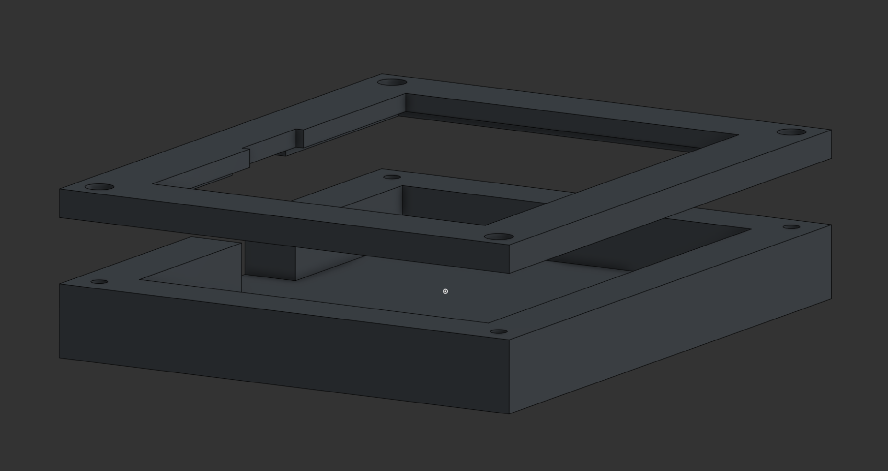

# Macpad

## Schematic
Made in [KiCAD](https://www.kicad.org/)

## PCB
Also made in [KiCAD](https://www.kicad.org/)

## Case
Made with [Onshape](https://www.onshape.com/en/)

## BOM
- 1 Seeed XIAO
- 9x through-hole 1N4148 Diodes
- 8x MX-Style switches
- 1 Rotary encoder
- 1 OLED display
- 8x white blank DSA keycaps
- 12x SK6812 MINI-E LEDs
- 4x M3x16mm screws